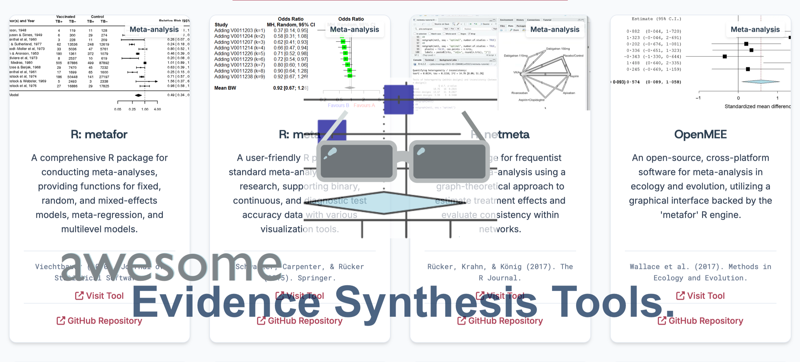

---

# Awesome Evidence Synthesis

A strictly open-source directory of **282+ tools** for systematic reviews, meta-analysis, and evidence synthesis. 

We promote **transparency, reproducibility, and Open Science** by only including non-proprietary software with publicly available source code.

---

## 🔗 Quick Links

Access the project across all platforms:

*   **Directory Web** (Live Site): [awesome-evidence-synthesis.github.io](https://awesome-evidence-synthesis.github.io)

*   **Awesome List** (Content Repo): [github.com/evidencesynthesis-tools/awesome-evidence-synthesis](https://github.com/evidencesynthesis-tools/awesome-evidence-synthesis)

*   **Directory Repo** (Website Source): [github.com/evidencesynthesis-tools/awesome-evidence-synthesis.github.io](https://github.com/evidencesynthesis-tools/awesome-evidence-synthesis.github.io)

*   **Main Organization** (Home): [github.com/evidencesynthesis-tools](https://github.com/evidencesynthesis-tools)

---

## ✨ Key Features

*   **100% Open Source:** No proprietary or freemium tools (e.g., no Covidence, EndNote, or Rayyan).
*   **Comprehensive Scope:** Covers Searching, Screening, Extraction, Risk of Bias, Meta-analysis, and Visualization.
*   **FAIR Aligned:** Verified licenses (MIT, GPL, Apache) and public repositories (GitHub, GitLab).
*   **Pure HTML:** The website is built with pure HTML for zero lock-in, long-term stability, and easy maintenance.

---

## 🎯 Who is this for?

*   Systematic Review Researchers
*   Meta-analysts & Methodologists
*   Medical & Public Health Researchers
*   Research Software Developers
*   Open Science Advocates

